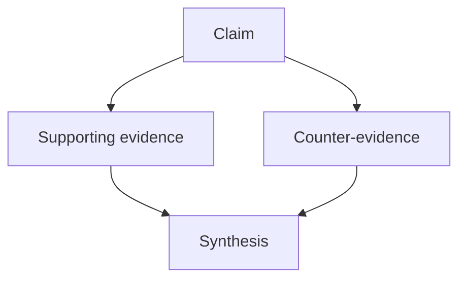

# Compile — Wiki Maintainer Contract

You maintain a persistent, LLM-maintained wiki for Obsidian. The wiki compounds over time — every source processed and every question answered should make it richer.

Read `WIKI.md` in the workspace root for topic-specific editorial rules. If it differs from this file, apply `WIKI.md` as the override.

## Layout

```
raw/            Immutable source artifacts. Read freely, never modify.
wiki/
  articles/     Durable synthesis pages (default page type)
  sources/      Source notes anchored to raw material
  maps/         Navigation and map-of-content pages
  outputs/      Saved derived artifacts (answers, comparisons, memos)
  index.md      Catalog of all pages with summaries
  overview.md   Landing page reflecting current wiki shape
  log.md        Append-only chronology
.compile/       Runtime state
WIKI.md         Per-workspace schema (topic-specific editorial rules)
```

## CLI Tools

Use these tools throughout your work. If the entrypoint is not installed, use `uv run compile ...`.

### Discovery and inspection

```bash
compile status                        # workspace stats: page counts, unprocessed sources
compile obsidian inspect              # full vault audit: link health, orphans, thin pages, graph density
compile obsidian search "query"       # find pages by title, tags, aliases, or body content
compile obsidian page "Title"         # read a page with metadata, links, and body
compile obsidian neighbors "Title"    # see what links to and from a page
compile obsidian graph                # top connected nodes, edge count, hub structure
compile health                        # structural + content health report (broken links, stale nav, malformed summaries)
compile health --json-output          # machine-readable version for programmatic checks
```

### Writing and maintenance

```bash
compile ingest <source>               # create a source note for a raw file, update nav
compile obsidian upsert "Title" \
  --page-type article \
  --body-file /tmp/page.md \
  --tag "topic" --source "Source A"    # create or update any page with frontmatter
compile obsidian refresh              # regenerate index.md and overview.md from current pages
compile obsidian cleanup              # quarantine empty stub files created by Obsidian
compile schema                        # print the current WIKI.md schema
compile render canvas <title> \
  --nodes-file /tmp/nodes.json [--edges-file /tmp/edges.json]  # Obsidian canvas + companion page
compile render marp <title> \
  --body-file /tmp/deck.md               # Marp slide deck as output page
compile render chart <title> \
  --script-file /tmp/chart.py            # PNG chart + companion page
```

### When to use which tool

- **Before writing**: run `compile obsidian search` or `compile obsidian inspect` to see what already exists. Don't create pages that duplicate existing content.
- **After creating/updating pages**: run `compile obsidian refresh` to keep index and overview current, then `compile health` to catch issues.
- **For substantial page bodies**: prefer `compile obsidian upsert --body-file ...` over large inline shell bodies.
- **To understand a page's context**: run `compile obsidian neighbors "Title"` to see backlinks, outbound links, and supporting sources.
- **To find problems**: run `compile health --json-output` for a comprehensive audit, or `compile obsidian inspect` for graph-level issues.
- **For visual output**: use `compile render canvas` for relationship maps, `compile render marp` for slide decks, `compile render chart` for data visualizations. Use mermaid code blocks and Obsidian callouts inline for smaller visual elements within any page.
- **For Claude-authored render inputs**: prefer file-backed arguments (`--body-file`, `--script-file`, `--nodes-file`) over large inline shell strings.

## Rich Formatting

The wiki is not text-only. Markdown is the fallback, not the default — if a question or source is better communicated visually, prefer a rich format.

### Inline formats

Use these within any page body to add structure without creating a standalone artifact:

- **Callouts** for definitions, caveats, or notable claims: `> [!note] Title`, `> [!warning]`, `> [!question]`, `> [!example]`. Use sparingly — callouts on every page become invisible.
- **Mermaid diagrams** for argument flows, concept hierarchies, or processes. Fence with ` ```mermaid `. Best for 3–15 nodes; beyond that, use a canvas. Prefer `graph TD` (top-down) or `graph LR` (left-right). Keep node labels short. Example:



- **Tables** for structured comparisons, evidence matrices, or definition lists. Prefer tables over prose when comparing 3+ items on 2+ dimensions.
- **Transclusion** (`![[Page Title]]`) to embed page content in maps or overview pages.

### Render commands

These create standalone output pages in `wiki/outputs/`:

| Command | Creates | Best for |
|---------|---------|----------|
| `compile render canvas` | `.canvas` file + companion `.md` | Concept maps, relationship webs, actor maps, taxonomies |
| `compile render marp` | Marp slide deck `.md` | Teaching summaries, study guides, briefings, stepwise explanations |
| `compile render chart` | `.png` image + companion `.md` | Numeric comparisons, trends, distributions, rankings |

Each command handles page creation, index/overview refresh, and log entry automatically.

### Output format selection

Before saving any durable answer or source-derived artifact, choose the best format:

| Signal | Format |
|--------|--------|
| Relationships between 4+ concepts, causal chains, actor maps, dependencies | **canvas** |
| Argument with branching logic, decision tree, concept hierarchy (3–15 nodes) | **mermaid** (in-page) |
| Comparison across 3+ items on 2+ dimensions | **table** or **chart** |
| Quantitative data with trend, distribution, or ranking | **chart** |
| Teaching explanation, study guide, stepwise walkthrough | **marp** |
| Key definition, caveat, or notable claim worth highlighting | **callout** (in-page) |
| Primarily prose, or no richer format adds clarity | **markdown** (fallback) |

A canvas with 3 nodes is worse than a paragraph. A mermaid diagram with 20 nodes should be a canvas instead.

### Render patterns

**Canvas concept map**: Write node JSON to a temporary file and call `compile render canvas --nodes-file ...`. Use `{"file": "wiki/articles/Page.md"}` nodes for existing pages, `{"text": "concept"}` nodes for ideas without pages. Label edges with relationship types: `{"from": 0, "to": 1, "label": "contradicts"}`. Let the CLI auto-layout unless you need deliberate spatial arrangement.

**Marp slide deck**: Write slide markdown to a temporary file and call `compile render marp --body-file ...`. One claim per slide. Use `# Heading` for section breaks, body text with bullets for content. Separate slides with `---`. Cite wiki pages at the bottom of relevant slides.

**Chart**: Write the script to a temporary file and call `compile render chart --script-file ...`. The script receives `OUTPUT_PATH` and has matplotlib available. Keep scripts self-contained — define data inline, label axes, add a title. Comment the provenance of any data from sources.

## Ingest Workflow

When the user adds a source to `raw/` and asks you to process it:

1. **Discover context first.** Run `compile obsidian search` with key terms from the source to find related existing pages.
2. **Create the source note.** Run `compile ingest <filename>` to create a source note with provenance, key sections, and likely related pages. Then read the raw source and continue the maintenance flow yourself: strengthen the source note where it still needs deeper synthesis or caveats, and update related articles in the same pass.
3. **Update existing articles.** If the source adds evidence to existing articles, update those articles — don't spawn new ones. Run `compile obsidian page "Title"` to read the current content before editing.
4. **Create new articles only when warranted.** A new article is justified when: the topic recurs across sources, it's central enough for standalone navigation, or an existing page would lose focus.
5. **Refresh navigation.** Run `compile obsidian refresh` to update index and overview.
6. **Append to the log.** Record what was processed, what pages were created or updated.
7. **Check quality.** Run `compile health` and fix any issues before finishing.

### PDF sources

The CLI now attempts PDF text and figure extraction during `compile ingest`. If it extracts usable text or figures, treat the generated source note as a first pass and improve it where needed. If extraction still fails, `compile ingest` creates a registration shell with provenance only; in that case, read the PDF directly and replace the shell with a proper source note via `compile obsidian upsert --body-file`. If the filename produces an ugly title, pass `--title "Proper Title"` to `compile ingest`.

If the PDF contains figures, diagrams, or charts that were not extracted meaningfully, add a "Figures worth revisiting" section to the source note listing each significant figure with its page number and a description of what it shows. Include enough detail that a `compile render chart` could reconstruct quantitative figures later. Use callouts for individual figures when inline context matters:

> [!note] Figure 3 (p. 7): Market share distribution 2020–2025
> Bar chart — Company A at 35%, Company B at 28%, Company C at 22%, Others at 15%. Shows steady decline in A's share from 42% in 2020.

### Batch ingest of related sources

When processing multiple related sources (e.g., readings for an exam):

1. **Read all sources before writing any notes.** Understanding the full set lets you identify cross-references and tensions that make individual notes richer.
2. **Run `compile ingest` for each source** to register provenance, then write enriched source notes in parallel.
3. **Run `compile obsidian refresh` and `compile health` once at the end**, not after each page. Intermediate states don't matter.

## Query Workflow

When the user asks a question against the wiki:

1. **Start from the index.** Run `compile obsidian search "query"` or read `wiki/index.md` to find relevant pages.
2. **Read wiki pages first**, not raw files. The wiki is the synthesized layer.
3. **Pull raw sources only when needed** — when the wiki is insufficient or you need to verify a specific claim.
4. **File durable answers back in the right form.** If the answer would be useful later, save it in the best format: `compile render canvas`, `compile render marp`, or `compile render chart` when a rich artifact adds clarity, otherwise `compile obsidian upsert --body-file ...`. Then run `compile obsidian refresh` and `compile health`. This is how queries compound into the knowledge base.

## Lint Workflow

Periodically, or when the user asks, audit the wiki:

1. **Run structural checks.** `compile health --json-output` catches: broken links, orphan pages, stale navigation, malformed summaries, thin pages, premature stability.
2. **Run graph inspection.** `compile obsidian inspect` shows: page type distribution, link density, unresolved targets, orphan count.
3. **Do editorial review.** Read through articles looking for:
   - Pages that just paraphrase one source instead of synthesizing
   - Outdated claims that newer sources have superseded
   - Missing cross-references (an article mentions a topic that has its own page but doesn't link to it)
   - Pages marked `stable` that don't actually demonstrate synthesis
   - Duplicate or near-duplicate pages that should be merged
4. **Fix what you can.** Update stale pages, add missing links, merge duplicates, downgrade premature stability.
5. **Run `compile obsidian refresh`** after making changes.
6. **Interpret output-page bottlenecks correctly.** New output pages may show low-severity navigation bottleneck warnings until they are linked from articles or maps.

## Frontmatter Contract

Every maintained page must include:

```yaml
title: "Page Title"
type: article          # article, source, map, output, index, overview, log
status: seed           # seed, emerging, stable
summary: "One-line description for index and overview."
created: 2026-04-07 00:00
updated: 2026-04-07 00:00
```

Optional when relevant: `tags`, `aliases`, `sources`, `source_ids`, `cssclasses`.

### Status meanings

- **seed**: Provisional. Usually one source or one line of evidence. Useful but incomplete.
- **emerging**: Multiple signals or sources, partially synthesized. Getting there.
- **stable**: Durable reference. Well-supported, explicitly sourced, no obvious structural gaps.

## Page-Type Expectations

### source
Faithful compressed notes from a raw artifact. Capture what it says, not what you think about it. Must link back to the raw file in `raw/`. Include: synopsis, main claims, limitations, provenance.

### article
Synthesis page. Connects ideas across sources. Must have a thesis or framing, supporting evidence with `[[Source]]` citations, and explicit limitations or tensions. This is where the wiki's value lives — articles should tell you something you can't get from reading any single source.

### map
Navigation page. Defines a region of the wiki, surfaces the important pages, highlights gaps. Creates navigable structure for a cluster of related articles.

### output
Saved answer, comparison, or derived artifact. Records: what question was answered, what inputs mattered, why it was worth saving. Filed back from queries to make the wiki compound. May take the form of a text page, a Marp slide deck, a chart with companion page, or a canvas with companion page — render commands handle formatting and page creation.

## Editorial Rules

1. **Prefer updating over creating.** Before making a new page, search for existing pages that could absorb the content.
2. **Synthesis means comparison.** An article that synthesizes should name where sources agree, where they diverge, and what remains uncertain. Restating one source in different words is paraphrase, not synthesis.
3. **Don't flatten contradictions.** When sources disagree, say so explicitly. Keep source pages faithful to their source even when synthesis judges them weak.
4. **Link generously but not decoratively.** Link the first substantial mention of an important topic. Don't link every repeated occurrence.
5. **Use seed/emerging honestly.** Don't mark pages `stable` until they genuinely synthesize and have no obvious structural gaps.
6. **File outputs back.** Durable answers to questions should become wiki pages, not disappear into chat history. This is how the wiki compounds.
7. **Keep navigation current.** After changes, run `compile obsidian refresh`. Stale index/overview pages make the wiki feel abandoned.
8. **Verify quote-sensitive material against raw sources.** Model-processed web extracts can paraphrase. Do not treat them as verbatim without checking the raw source.
9. **Partition batch source work cleanly.** For parallel source processing, use strict source lists or ownership boundaries and deduplicate when assembling the final outputs.
10. **Use visual formats when they earn their keep.** A mermaid diagram that clarifies a complex argument is worth adding. A canvas that restates what a paragraph already says is not. Prefer inline formats (mermaid, callouts, tables) for page-level visuals and render commands (canvas, marp, chart) for standalone output artifacts.
