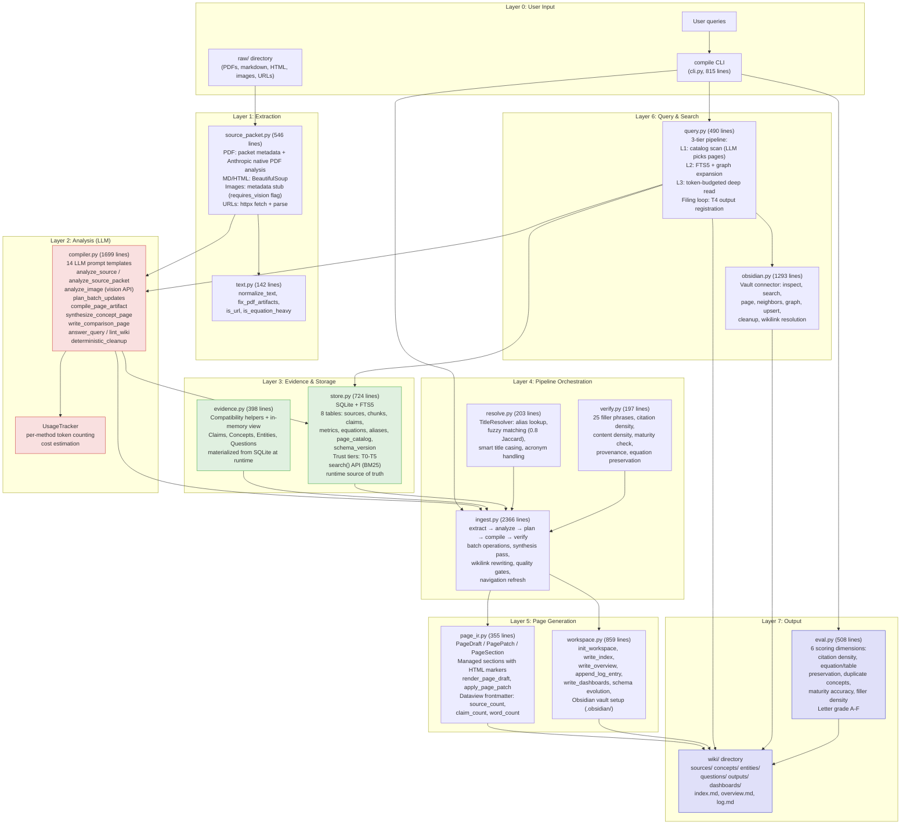
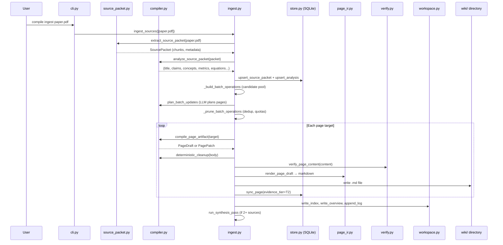

# Compile — Architecture Diagram & Honest Assessment

## Architecture Diagram



## Data Flow: PDF → Wiki Page



## Trust Tier Model

```
T0  Raw source file (raw/)           ──── Can support claims ✓  Can promote maturity ✓
T1  Extracted source packet           ──── Can support claims ✓  Can promote maturity ✓
T2  Maintained source/concept note    ──── Can support claims ✓  Can promote maturity ✓
T3  Synthesis/comparison page         ──── Retrieval only
T4  Saved query output                ──── Retrieval only, never auto-promoted
T5  Web search candidate              ──── Suggestion only
```

---

## Comparison: llm-wiki.md Spec vs. Compile Implementation

### What the spec calls for → What Compile does

| Spec Requirement | Status | Implementation |
|---|---|---|
| Drop sources into raw/, LLM compiles wiki | ✅ Done | `compile ingest` processes PDFs/MD/HTML/URLs, LLM writes all pages |
| Wiki = directory of .md files | ✅ Done | `wiki/{sources,concepts,entities,questions,outputs,dashboards}/` |
| Summaries, entity pages, concept pages, backlinks | ✅ Done | PageDraft system, wikilink resolution, managed sections |
| Obsidian as IDE frontend | ✅ Done | Full `.obsidian/` setup, CSS snippets, graph color groups, Dataview frontmatter |
| Obsidian Web Clipper for ingest | ⚠️ Partial | URL ingestion exists (`compile ingest https://...`) but not Clipper-native |
| Download images locally for LLM | ⚠️ Partial | `analyze_image` exists but image-in-markdown viewing is metadata-only stub |
| Q&A against wiki with citations | ✅ Done | 3-tier L1/L2/L3 pipeline, format options (note/comparison/marp/mermaid) |
| File outputs back into wiki | ✅ Done | `--save` registers as T4, cross-references preserved, trust-constrained |
| Marp slides, matplotlib, charts | ⚠️ Partial | Marp/mermaid/chart-spec format flags exist, but no actual rendering |
| Linting / health checks | ✅ Done | `compile health` for canonical health, `compile lint` for content audit, plus verifier checks for filler phrases/citation density/maturity |
| index.md as catalog with summaries | ✅ Done | Deterministic index generation with per-page summaries |
| log.md as chronological record | ✅ Done | Append-only with parseable `## [timestamp] kind \| title` format |
| LLM reads index first, then drills in | ✅ Done | L1 catalog scan → L2 FTS search → L3 budgeted deep read |
| Search engine over wiki (qmd-like) | ⚠️ Partial | FTS5 BM25 search exists, no vector/embedding search, no qmd MCP |
| Schema (CLAUDE.md) co-evolved | ✅ Done | `compile schema show/refresh`, versioned WIKI.md with LLM-proposed revisions |
| Wiki is a git repo | ❌ Removed | User explicitly removed all git behavior |
| Synthetic data + finetuning exploration | ❌ Not started | Out of scope |
| Incremental compile (only changed files) | ✅ Done | `state.json` tracks processed files, only unprocessed are ingested |
| ~100 articles, ~400K words scale | ✅ Designed for | Token budgeting, FTS5, batched ingest with parallelism |

### What Compile adds beyond the spec

| Feature | Detail |
|---|---|
| Trust tier model (T0-T5) | Spec doesn't mention evidence tiers — Compile prevents derived artifacts from contaminating evidence |
| Editorial pipeline | `deterministic_cleanup` + expanded verification catches fluff the LLM produces |
| Batch planning with quotas | Spec says "might touch 10-15 pages" — Compile has explicit quota management to prevent concept explosion |
| Cost tracking | `UsageTracker` reports tokens/cost per operation |
| Benchmark harness | `compile eval` scores quality across 6 dimensions with letter grades |
| Managed sections (PagePatch) | HTML markers enable surgical section-level updates instead of full rewrites |
| Runtime evidence storage | SQLite is the runtime source of truth; JSON helpers remain only for compatibility/tests |

---

## Honest Assessment

### What works well

1. **The pipeline architecture is sound.** The extract → analyze → plan → compile → verify → write flow is well-structured. Each stage has clear inputs/outputs, and the batch orchestration in `ingest.py` handles multi-source synthesis correctly.

2. **The Obsidian integration is thorough.** CSS snippets, graph color groups, Dataview frontmatter, wikilink resolution, vault health inspection — this is production-quality Obsidian support.

3. **The trust tier model is the right answer** to the filing loop poisoning problem that Codex flagged. T4 outputs can't promote maturity. This is architecturally correct.

4. **The verification system catches real problems.** 25 filler phrases, citation density checks, maturity validation, content density — these are the right guardrails.

5. **FTS5 search is a solid foundation.** BM25 across pages, chunks, and claims with automatic sync triggers. The `search()` API is designed for embedding search to slot in later.

### What doesn't work

1. **The product boundary is still split between two workspace modes.** `compile_workspace` is the real Obsidian-facing product, while `backend_workspace` is a backend export format. Until that distinction is explicit in all docs and generation paths, users will keep treating backend exports as if they were vault-quality wikis.

2. **Health reporting was fragmented.** `compile lint`, `compile obsidian inspect`, and backend `health/latest.json` historically described different things and could disagree. The health model now needs to stay canonical: readiness, graph quality, and content audit must not collapse into one misleading sentence.

3. **PDF fidelity is better than before, but benchmarking is stale.** Runtime analysis now uses Anthropic native PDF support instead of local `pypdf` extraction. That removes the worst local-text-extraction failure mode, but the benchmark and eval commentary still reflect the old pipeline and need to be rerun honestly.

4. **Citation density is still too low.** The benchmark scored 58/173 claim sentences with `[[wikilinks]]`. Two-thirds of factual claims in concept pages are unsupported. The editorial pipeline catches filler but doesn't enforce citation at generation time strongly enough.

5. **The "edit" LLM pass was not implemented.** Phase 3 called for compose → **edit** → verify. The compose and verify stages exist, but the edit pass (a second LLM call to tighten prose) was replaced with `deterministic_cleanup` only.

6. **Entity deduplication still misses obvious cases.** "Llama 3" and "Llama3" are separate pages. The fuzzy matcher uses Jaccard over word tokens, so single-word entities with punctuation or spacing differences slip through.

7. **The query L1/L2 tiers may still over-spend on small and medium wikis.** The small-wiki shortcut (< 15 pages) is too conservative for the current page selection strategy.

8. **`compile eval --rebuild` still needs a clean config handoff.** Temporary workspaces and API credentials are not handled cleanly enough for repeatable benchmarking.

### Benchmark Scorecard (10 ArXiv PDFs)

```
Pages generated:         53 (10 source, 20 concept, 10 entity, 4 question, 2 output, 7 dashboard)
Citation density:        33.5%  (target: >70%)
Equation preservation:   vacuously 100% (0 found in sources — actually 0%)
Table preservation:      vacuously 100% (0 found in sources — actually 0%)
Duplicate concept rate:  0.0%   (good)
Maturity accuracy:       100%   (14/14 stable pages correctly classified)
Filler density:          2.4%   (5/206 paragraphs — good)
Grade:                   B
```

This scorecard reflects the older local PDF-extraction era. It should be rerun against the Anthropic-native PDF path before being treated as current.

### Priority fixes (honest ordering)

1. **Keep `compile_workspace` and `backend_workspace` semantics explicit** — backend exports should not be presented as Obsidian-ready unless they actually have vault affordances.

2. **Keep health reporting canonical** — structural readiness, graph quality, and content audit need one schema and one summary policy.

3. **Rerun eval on the new PDF pipeline** — the current benchmark narrative is stale after the Anthropic-native PDF switch.

4. **Raise the small-wiki threshold** in the query pipeline from 15 to something closer to the real break-even point.

5. **Improve entity deduplication** — normalize whitespace and punctuation before fuzzy matching, not just word tokens.

6. **Fix abstract/DOI extraction** — the regexes don't match real ArXiv paper formatting.
